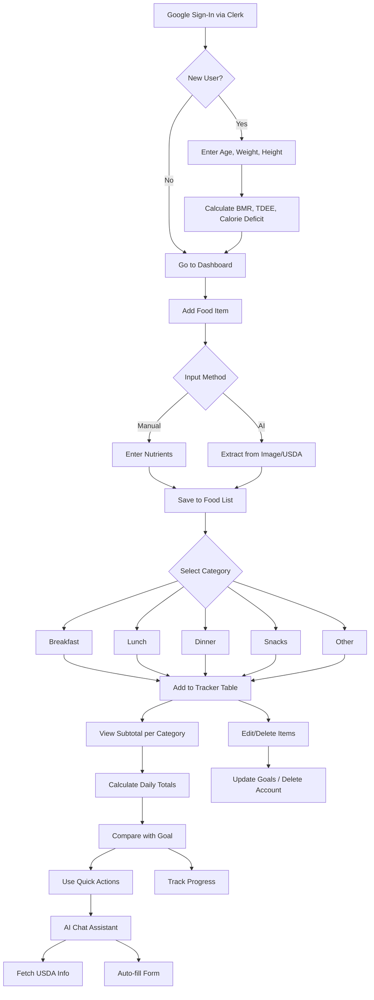

# DietTracker

**AI-Enabled Nutrition Management Web App**  
Track your daily food intake, calculate calories, and stay aligned with your fat-loss goals using AI-powered insights built on [USDA](https://fdc.nal.usda.gov/) datasets.


---

## Overview

**Diet Tracker** is a full-stack AI-enabled web application built with the latest web technologies like **Next.js**, **React**, **Prisma ORM**, **MongoDB**, **Tailwind CSS**, **Clerk**, and **AG Grid**. It integrates **Google Gemini 2.0 Flash** via **Vertex AI Studio**—fine-tuned on the USDA dataset—to help users track and analyze their diet with minimal manual input while maintaining a calorie deficit cycle for fat loss.

---

## Key Features

- **Google Authentication** (OAuth via Clerk)
- **Goal Setting**: Age, Weight, Height, BMR, TDEE, Calorie Deficit
- **Manual or AI-Powered Food Logging** (USDA or Image-to-Nutrition via AI Agent)
- **Category Tracking**: Breakfast, Lunch, Dinner, Snacks, Other
- **Live Tracker Tables** (AG Grid) with real-time nutrient subtotals
- **Quick Add Buttons** and floating AI assistant
- **Persistent Food Lists** for faster future tracking
- **Dynamic Nutrient Analysis** and Calorie Goal Comparison
- **Account Editing, Goal Reset & Deletion (Clerk)**

---

## AI Integrations

- **AI Assistant**:
  - Get nutritional values of food items from the USDA dataset.
  - Explain nutritional values in detail.
  - Auto-fill the Add Food Item form with JSON data generated by the AI model.
    
- **Image Parsing**: Upload or capture nutritional labels for automatic parsing and form-filling using Google Gemini 2.0 Flash.

## Food Item Management
- **Add Food Items**: Fill a form with food name and nutritional values manually or upload a product nutrition label image for AI parsing.
- **Categorize Food Items**: Track food under predefined categories (Breakfast, Lunch, Dinner, Snacks, and Other) using enums.
- **Reusable Food List**: Save frequently used food items for quick reuse without re-entering details.
- **Update or Delete Food Items**: Easily modify or remove items directly from the tracker.

## Tracker
- **AG Grid Tracker**: Displays food items in a table with rows for items and columns for nutrients (Carbs, Protein, Fat, Sugar, etc.).
- **Category-Specific Tracking**: Maintain separate trackers for each category.
- **Nutrition Subtotals**: Automatically calculates subtotal for nutrients in each tracker.
- **Total Nutrition Calculation**: Calculate total nutrients across all categories to compare against calorie deficit goals.

## Optimization
- **Debounced Input**: Avoids unnecessary API calls for fetching food items by implementing a debouncing algorithm.
- **Recent Item Fetching**: Quickly fetches recently added items from diet state management to avoid redundant API calls.
- **USDA API Integration**: Fetch nutritional data from the USDA API.

## User Profile
- **Account Management**: Delete the user account directly from the profile settings.
- **Goal Updates**: Update personal data and calorie goals from the Goal page.

---

## App Workflow



---

## Tech Stack

| Layer                 | Technologies & Services                              |
| --------------------- | ----------------------------------------------------- |
| Front-end Framework   | Next.js 14 (App Router), React 19                     |
| UI & Styling          | Shadcn UI, Tailwind CSS, AG Grid                     |
| Language & Typing     | TypeScript, Javascript, ES2024+                      |
| State Management      | React Context & Hooks, Debounce Utility               |
| Authentication        | Clerk (OAuth2 / JWT)                                  |
| Back-end & ORM        | Next.js API Routes, Next.js Server Action, Prisma ORM |
| Database              | MongoDB Atlas                                         |
| AI & ML               | Google Vertex AI Studio, Goole AI Studio, Gemini 2.0 Flash model|
| APIs                  | USDA API, Custom REST Endpoints                       |
| Storage               | Cloudinary                                            |
| Deployment            | Vercel (Front-end), Google Cloud (Vertex AI + Functions) |

---

## Installation

1. Clone the repository:
   ```bash
   git clone https://github.com/your-username/diet-tracker.git
   cd diet-tracker
   ```

2. Install dependencies:
   ```bash
   npm install
   ```

3. Set up environment variables:
   - Create a `.env` file in the root directory.
   - Add your API keys and configuration settings for:

     ```
      DATABASE_URL=your_mongodb_connection_string
      NEXT_PUBLIC_URL=your_public_url
      NEXT_PUBLIC_CLERK_PUBLISHABLE_KEY=your_clerk_publishable_key
      CLERK_SECRET_KEY=your_clerk_secret_key
      SIGNING_SECRET=your_clerk_google_signing_secret
      NEXT_PUBLIC_CLERK_SIGN_IN_URL=your_signin_url
      GEMINI_API_KEY=google_gemini_api
      CLOUDINARY_CLOUD_NAME=your_cloud_name
      CLOUDINARY_API_KEY=your_api_key
      CLOUDINARY_API_SECRET=your_api_secret
     ```

4. Run the development server:
   ```bash
   npm run dev
   ```

5. Open the application in your browser:
   ```
   http://localhost:3000
   ```

---

## Usage

- Log in and set your personal goals (optional).
- Add food items manually or via AI-assisted form filling.
- Track your diet using category-specific trackers.
- Use AI chat for nutritional insights and quick actions.

---

## Screenshots


---

## Contributing

Contributions are welcome! Please follow the steps below:

1. Fork the repository.
2. Create a new branch:
   ```bash
   git checkout -b feature/your-feature-name
   ```
3. Commit your changes:
   ```bash
   git commit -m 'Add your feature description'
   ```
4. Push to the branch:
   ```bash
   git push origin feature/your-feature-name
   ```
5. Open a Pull Request.

---

## License

This project is licensed under the [MIT License](LICENSE).

---

## Author

Built with passion by **Chandan Kumar**
[LinkedIn](https://www.linkedin.com/in/webdevchandan/) | [Portfolio](https://webdevchandan.vercel.app/)
